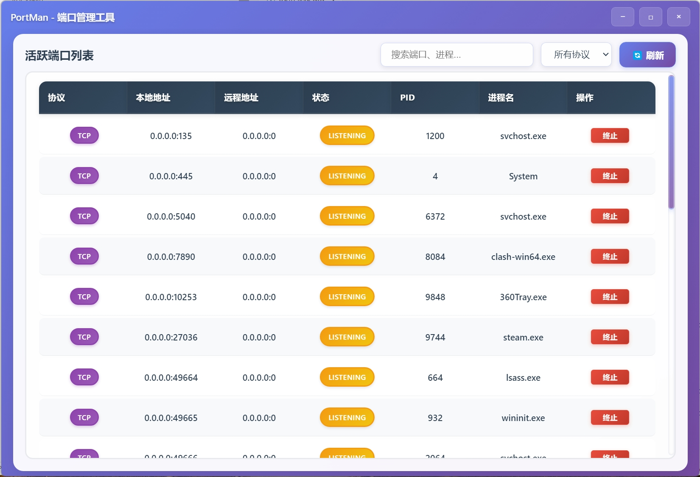

# 🚀 PortMan - 跨平台端口管理工具

<div align="center">




[](LICENSE)
[](https://github.com/SinoMiles/PortMan)
[](https://electronjs.org/)
[](https://nodejs.org/)

**一个现代化的跨平台端口管理工具，提供直观的图形界面来查看和管理系统端口使用情况**

[](https://github.com/SinoMiles/PortMan/actions)

[English](#english) | [中文](#中文)

</div>

---

## 中文

### 📖 项目简介

PortMan 是一个基于 Electron 的现代化跨平台桌面应用程序，专门用于监控和管理系统端口。它提供了美观直观的图形界面，让用户可以轻松查看端口占用情况、识别进程信息，并安全地终止不需要的进程。

### ✨ 主要功能

- 🖥️ **现代化界面**: 基于原生 HTML/CSS/JS 的美观现代界面
- 🔍 **端口监控**: 实时查看所有活跃的 TCP/UDP 端口
- 📊 **详细信息**: 显示协议、地址、状态、PID 和进程名
- 🎯 **进程管理**: 查看占用端口的进程详情并安全终止
- 🔄 **无限滚动**: 流畅的数据加载体验，支持大量端口显示
- 🎨 **现代设计**: 紫蓝渐变背景、毛玻璃效果、流畅动画
- 🖥️ **跨平台**: 支持 Windows、macOS 和 Linux
- 📦 **零配置**: 开箱即用，无需复杂配置

### 🚀 快速开始

#### 环境要求

- Node.js 16.0 或更高版本
- npm 或 yarn 包管理器

#### 安装步骤

1. **克隆仓库**
   ```bash
   git clone https://github.com/SinoMiles/PortMan.git
   cd portman
   ```

2. **安装依赖**
   ```bash
   npm install
   ```

3. **启动应用**
   ```bash
   npm start
   ```

#### 构建发布版本

```bash
# 构建当前平台版本
npm run build

# 构建 Windows 版本
npm run build:win

# 构建 macOS 版本
npm run build:mac

# 构建 Linux 版本
npm run build:linux
```

### 📖 使用指南

#### 基本功能

1. **查看端口信息**
   - 启动应用后自动显示当前系统的活跃端口
   - 显示协议类型、本地地址、远程地址、状态、PID 和进程名

2. **搜索和过滤**
   - 在搜索框中输入关键词进行实时搜索
   - 使用协议下拉菜单过滤 TCP/UDP 端口
   - 支持搜索端口号、IP 地址、进程名等

3. **进程管理**
   - 点击"终止"按钮可以结束占用端口的进程
   - 系统会要求确认操作以防误操作

4. **数据刷新**
   - 点击"🔄 刷新"按钮获取最新的端口信息
   - 支持无限滚动自动加载更多数据

#### 快捷键

- `Ctrl/Cmd + R` - 刷新端口信息
- `Ctrl/Cmd + F` - 聚焦搜索框
- `Ctrl/Cmd + W` - 关闭应用
- `Ctrl/Cmd + M` - 最小化窗口

### 🛠️ 技术架构

#### 核心技术栈

- **前端框架**: Electron + HTML5 + CSS3 + JavaScript
- **UI 设计**: 自定义 CSS，现代化渐变设计
- **系统调用**: Node.js 子进程调用系统命令
- **跨平台**: 基于 Electron 的跨平台解决方案

#### 项目结构

```
portman/
├── src/                    # 源代码目录
│   ├── main.js            # Electron 主进程
│   ├── preload.js         # 预加载脚本
│   ├── renderer.js        # 渲染进程逻辑
│   ├── index.html         # 主界面 HTML
│   └── styles.css         # 样式文件
├── docs/                  # 文档目录
├── package.json           # 项目配置
├── README.md             # 中文说明文档
└── README_EN.md          # 英文说明文档
```

#### 系统命令

不同平台使用不同的系统命令获取端口信息：

- **Windows**: `netstat -ano` + `tasklist`
- **macOS**: `netstat -anv`
- **Linux**: `netstat -tulpn`


### 🔧 系统要求

- **Windows**: Windows 10 或更高版本
- **macOS**: macOS 10.14 或更高版本
- **Linux**: 支持 AppImage 的现代 Linux 发行版

### 🤝 贡献

欢迎贡献代码！请遵循以下步骤：

1. Fork 本项目
2. 创建功能分支 (`git checkout -b feature/AmazingFeature`)
3. 提交更改 (`git commit -m 'Add some AmazingFeature'`)
4. 推送到分支 (`git push origin feature/AmazingFeature`)
5. 创建 Pull Request

### 📄 许可证

本项目采用 MIT 许可证 - 查看 [LICENSE](LICENSE) 文件了解详情。

---

## English

### 📖 Description

PortMan is a modern cross-platform desktop application built with Electron for monitoring and managing system ports. It provides a beautiful and intuitive graphical interface that allows users to easily view port usage, identify process information, and safely terminate unwanted processes.

### ✨ Features

- 🖥️ **Modern Interface**: Beautiful modern UI based on native HTML/CSS/JS
- 🔍 **Port Monitoring**: Real-time view of all active TCP/UDP ports
- 📊 **Detailed Information**: Display protocol, address, state, PID and process name
- 🎯 **Process Management**: View process details occupying ports and terminate safely
- 🔄 **Infinite Scroll**: Smooth data loading experience for large port lists
- 🎨 **Modern Design**: Purple-blue gradient backgrounds, glass morphism effects, smooth animations
- 🖥️ **Cross-Platform**: Support for Windows, macOS, and Linux
- 📦 **Zero Configuration**: Ready to use out of the box, no complex setup required

### 🚀 Quick Start

#### Requirements

- Node.js 16.0 or higher
- npm or yarn package manager

#### Installation Steps

1. **Clone Repository**
   ```bash
   git clone https://github.com/yourusername/portman.git
   cd portman
   ```

2. **Install Dependencies**
   ```bash
   npm install
   ```

3. **Start Application**
   ```bash
   npm start
   ```

#### Build Release Version

```bash
# Build for current platform
npm run build

# Build for Windows
npm run build:win

# Build for macOS
npm run build:mac

# Build for Linux
npm run build:linux
```

### 📖 User Guide

#### Basic Functions

1. **View Port Information**
   - Automatically displays active ports on system startup
   - Shows protocol type, local address, remote address, state, PID and process name

2. **Search and Filter**
   - Enter keywords in search box for real-time search
   - Use protocol dropdown to filter TCP/UDP ports
   - Support searching port numbers, IP addresses, process names, etc.

3. **Process Management**
   - Click "Terminate" button to end processes occupying ports
   - System will ask for confirmation to prevent accidental operations

4. **Data Refresh**
   - Click "🔄 Refresh" button to get latest port information
   - Support infinite scroll for automatic loading of more data

#### Keyboard Shortcuts

- `Ctrl/Cmd + R` - Refresh port information
- `Ctrl/Cmd + F` - Focus search box
- `Ctrl/Cmd + W` - Close application
- `Ctrl/Cmd + M` - Minimize window

### 🛠️ Technical Architecture

#### Core Tech Stack

- **Frontend Framework**: Electron + HTML5 + CSS3 + JavaScript
- **UI Design**: Custom CSS with modern gradient design
- **System Calls**: Node.js child process system commands
- **Cross-Platform**: Electron-based cross-platform solution

#### System Commands

Different platforms use different system commands to get port information:

- **Windows**: `netstat -ano` + `tasklist`
- **macOS**: `netstat -anv`
- **Linux**: `netstat -tulpn`

### 📱 Screenshots

The application includes the following main interfaces:
- System information dashboard
- Port list table
- Process termination confirmation dialog
- Multi-language toggle switch
- Real-time data refresh

### 🔧 System Requirements

- **Windows**: Windows 10 or higher
- **macOS**: macOS 10.14 or higher
- **Linux**: Modern Linux distributions supporting AppImage

### 🤝 Contributing

Contributions are welcome! Please follow these steps:

1. Fork the project
2. Create a feature branch (`git checkout -b feature/AmazingFeature`)
3. Commit your changes (`git commit -m 'Add some AmazingFeature'`)
4. Push to the branch (`git push origin feature/AmazingFeature`)
5. Create a Pull Request

### 📄 License

This project is licensed under the MIT License - see the [LICENSE](LICENSE) file for details.

---

Made with ❤️ by the PortMan team
